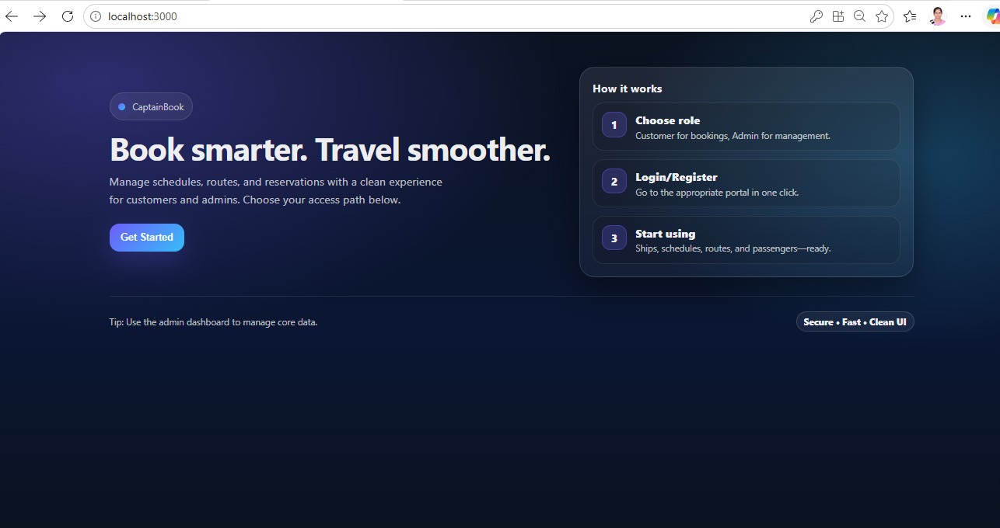
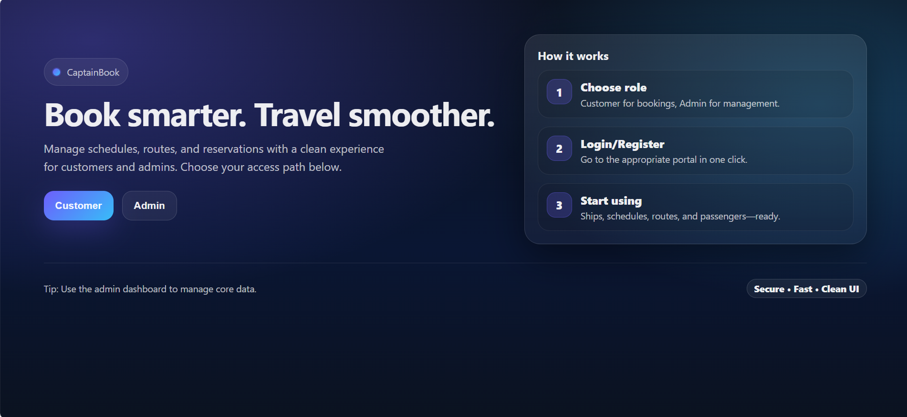

# 🚢 Ship Reservation System

A full-stack web application designed to simplify ship ticket booking and reservation management. Users can browse available ships, view schedules, reserve tickets, and manage bookings through a modern and user-friendly interface.

## 📖 Project Overview

The Ship Reservation System streamlines the process of booking ship tickets by providing an efficient platform for users to search routes, check availability, and manage reservations. The project demonstrates full-stack development using React.js, Spring Boot, and MySQL.

## Home Page

## Login Page
* After clicking Get Started in the Home Page, Login Page appears.
* Here, We can login as Admin/Customer

## ✨ Features

* User Registration and Login
* Browse Available Ships and Routes
* View Ship Schedules
* Book Ship Tickets
* Cancel Reservations
* Manage Booking Details
* Responsive User Interface
* Database Integration
* REST API Communication

## 🛠️ Tech Stack

### Frontend

* React.js
* HTML
* CSS
* JavaScript

### Backend

* Spring Boot
* Java
* REST APIs

### Database

* MySQL

### Version Control

* Git
* GitHub

## 📂 Project Structure

Ship-Reservation-System/

├── frontend/

│   ├── src/

│   ├── public/

│   └── package.json

│

└── backend/

    ├── src/

    ├── pom.xml

    └── ...

## 🎯 Learning Outcomes

* Full-Stack Web Development
* React.js Frontend Development
* Spring Boot Backend Development
* REST API Integration
* Database Management with MySQL
* Git and GitHub Workflow

## 📌 Future Enhancements

* Online Payment Integration
* Email Notifications
* Seat Selection System
* Admin Dashboard
* Real-Time Availability Updates
