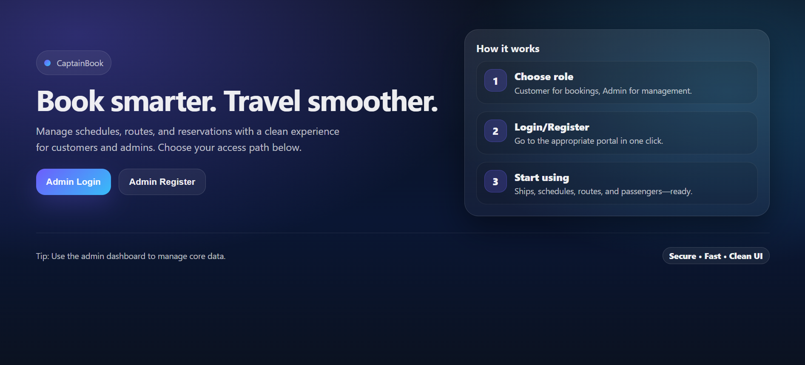
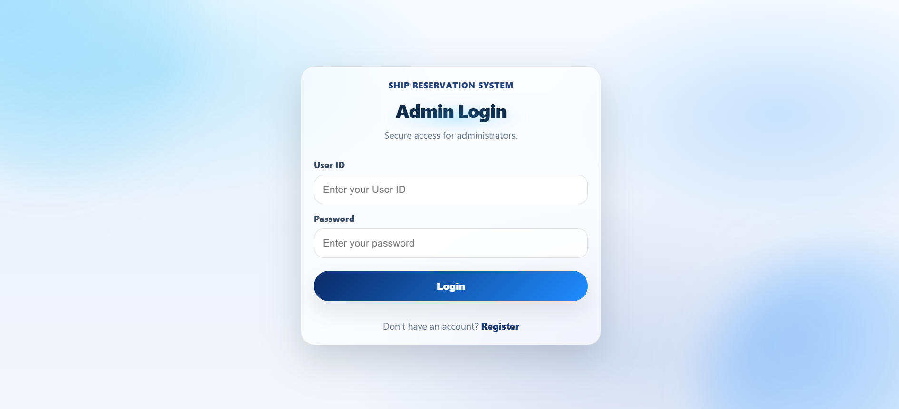
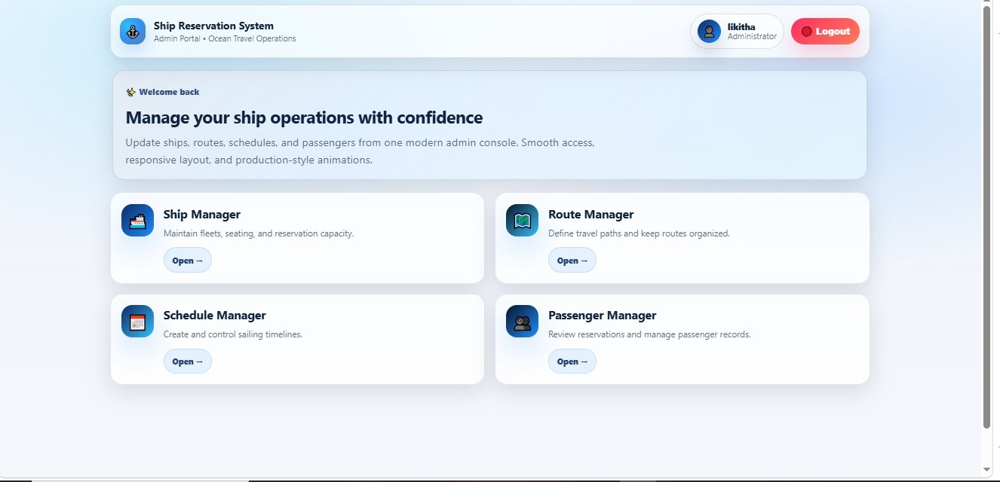

# Ship Reservation System(SRS)

# 🚢 CaptainBook Frontend

A modern and responsive frontend application for the **Ship Reservation System** built using **React.js**. This application provides an intuitive interface for users to search ships, book tickets, manage reservations, and view booking details seamlessly.

## Admin Page 
* In Home Page, If we click as Admin. Then Admin Login and Admin Register appears as
  
  

* If already have an account, We can Login by clicking Admin Login. If Don't have an account, We can register as Admin    Register and then login.
  
   

* In Admin Page, We can manage the Admin Dashboard 
  
  

## 🌟 Features

* 🔐 User Authentication (Login & Registration)
* 🚢 Search Available Ships
* 📅 View Ship Schedules
* 🎫 Book Ship Tickets
* 📋 View Reservation Details
* ❌ Cancel Reservations
* 📱 Responsive User Interface
* ⚡ Fast and Interactive Experience using React.js

## 🛠️ Tech Stack

* React.js
* JavaScript (ES6+)
* HTML5
* CSS3
* React Router
* Axios

## 📂 Project Structure

```text
frontend/
│
├── public/
├── src/
│   ├── admin/
│   ├── api/
│   ├── components/
│   ├── pages/
│   ├── App.css
│   ├── App.js
│   ├── App.test.js
│   ├── index.css
│   └── index.js
├── .gitignore
├── package.json
├── package-lock.json
└── README.md
```

## 🔗 Backend Repository

This frontend application communicates with the Ship Reservation System backend API.

Make sure the backend server is running before accessing the frontend application.

## 🎯 Future Enhancements

* Online Payment Integration
* Booking History
* Email Notifications
* Seat Selection System
* Admin Dashboard
